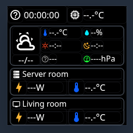

# MiniTV — ESPHome LVGL Dashboard

A compact always-on dashboard built on an ESP32-PICO-D4 with a 240×240 ST7789V3 display, showing home automation data from Home Assistant via an LVGL-based UI.



---

## Hardware

| Component | GPIO | Notes |
|-----------|------|-------|
| ST7789V3 240×240 LCD — SCL | IO18 | SPI clock |
| ST7789V3 240×240 LCD — SDA | IO23 | SPI MOSI |
| ST7789V3 240×240 LCD — RS | IO2 | DC pin (strapping pin — keep low at boot) |
| ST7789V3 240×240 LCD — Reset | IO19 | |
| ST7789V3 240×240 LCD — CS | GND | Permanently selected |
| ST7789V3 240×240 LCD — Backlight | IO4 | PWM via LEDC |
| WS2812B status LED | IO27 | Single LED, GRB order |
| Capacitive touch — Left | IO13 | esp32_touch, threshold 500 (needs calibration) |
| Capacitive touch — Right | IO15 | esp32_touch, threshold 500 (needs calibration) |

**Chip:** ESP32-PICO-D4, ESPHome board: `pico32`, framework: `esp-idf`

---

## Screen Layout

```
┌──────────────────────────────────────┐  y=0
│ [WiFi icon]  HH:MM:SS │ [chip] °C   │  Status bar (35px)
├───────────────────────────────────────  y=40
│ [Weather  │ 🌡°C    💧Humidity%    │
│  icon]    │ ☀Rise   ☽Set           │  Weather area (80px)
│ mm/dd     │ 📅Weekday  🔵Pressure  │
├───────────────────────────────────────  y=125
│ [server]  Server room               │
│ ⚡NNNw    🌡NN.N°C                 │  Server room (55px)
├───────────────────────────────────────  y=185
│ [tv]      Living room               │
│ ⚡NNNw    🌡NN.N°C                 │  Living room (55px)
└──────────────────────────────────────┘  y=240
```

**Background:** pure black `0x000000`. Section containers are fully transparent; only weather area and the two room sections have a `0x4B5563` border with radius 8.

---

## Icon Accent Colors

Each metric icon has a distinct color to aid quick reading:

| Icon | Color | Hex |
|------|-------|-----|
| Temperature (outdoor + rooms) | Blue | `#005EFF` |
| Humidity | Cyan | `#00EAFF` |
| Sunrise | Orange-red | `#FF4800` |
| Sunset | Amber | `#FFB700` |
| Weekday | Gray | `#999999` |
| Pressure | Green | `#11FF00` |
| Power (⚡ bolt, rooms) | Amber | `#FFB700` |

---

## Data Sources

See [`MINITV_DATASOURCE.md`](MINITV_DATASOURCE.md) for the full widget ID → sensor mapping. Summary:

| Widget | Source |
|--------|--------|
| Time / date / weekday | `ha_time` (homeassistant platform), updated every 1s |
| WiFi icon | `wifi_signal` sensor — adaptive 4-level strength icon, updated every 1s |
| Chip temp | `internal_temperature` sensor, updated every 30s |
| Weather icon | `sensor.openweathermap_weather_code` → MDI glyph mapping |
| Outdoor temp / humidity / pressure | OpenWeatherMap HA sensors |
| Sunrise / Sunset | `sensor.sun_next_rising/setting` — UTC ISO 8601 → local HH:MM |
| Server room power / temp | Shelly PM Mini G3 + `sensor.server_room_temperature` |
| Living room power / temp | Shelly PM Mini G3 + `sensor.living_room_current_temperature` |

---

## Fonts

| ID | Size | Font | Used for |
|----|------|------|----------|
| `mdi_icons_16` | 16px | MDI webfont | Row icons: thermometer, gauge, server, TV, weather-sunny (sunrise), weather-night (sunset), calendar-week (weekday) |
| `mdi_icons_24` | 24px | MDI webfont | WiFi signal icon, chip temp icon, room thermometer icons |
| `mdi_icons_44` | 44px | MDI webfont | Large weather icon |
| `montserrat_16` | 16px | LVGL built-in | Weather metric values, section header labels |
| `montserrat_18` | 18px | LVGL built-in | Time, date, room metric values |
| `montserrat_24` | 24px | LVGL built-in | Power bolt icon (`\uF0E7`) |

`montserrat_*` fonts are **LVGL built-ins** — no `font:` block definition required.

---

## WiFi Icon Logic

`status_bar_wifi_signal_icon` uses `mdi_icons_24` from boot. The 1-second interval updates both text and font. Disconnected state (`\U000F092B`) is also the initial/default widget value.

| RSSI | Glyph | MDI name |
|------|-------|----------|
| Not connected | `\U000F092B` | mdi:wifi-strength-alert-outline |
| `< −75 dBm` | `\U000F091F` | mdi:wifi-strength-1 (very weak) |
| `−75` to `−65 dBm` | `\U000F0922` | mdi:wifi-strength-2 (weak) |
| `−65` to `−55 dBm` | `\U000F0925` | mdi:wifi-strength-3 (medium) |
| `≥ −55 dBm` | `\U000F0928` | mdi:wifi-strength-4 (strong) |

---

## Weather Icon Mapping (OpenWeatherMap codes)

| OWM code | Glyph | MDI name |
|----------|-------|----------|
| 800 | `\U000F0599` | mdi:weather-sunny |
| 801–803 | `\U000F0595` | mdi:weather-partly-cloudy |
| 804 | `\U000F0590` | mdi:weather-cloudy |
| 500–531, 300–321 | `\U000F0597` | mdi:weather-rainy |
| 600–622 | `\U000F0598` | mdi:weather-snowy |
| 200–232 | `\U000F0593` | mdi:weather-lightning |
| 700–780 | `\U000F0591` | mdi:weather-fog |
| 781 | `\U000F0F38` | mdi:weather-tornado |

---

## Status LED

Single WS2812B pulses on a 3-second sine-wave cycle (checked every 5s). Color reflects connectivity:

| State | Color |
|-------|-------|
| WiFi + HA API connected | Green |
| WiFi only (no API) | Blue |
| No WiFi | Red |

Brightness is controllable from HA via the **MiniTV LED Max Brightness** number entity (0–100%, default 30%).

---

## Sunrise / Sunset UTC Conversion

`sensor.sun_next_rising` and `sensor.sun_next_setting` expose UTC ISO 8601 datetimes. The `on_value` lambda converts to local time by deriving the UTC offset from `ha_time.now()` vs `ha_time.utcnow()` at call time, which handles DST automatically:

```cpp
auto local = id(ha_time).now();
auto utc   = id(ha_time).utcnow();
int off = (local.hour - utc.hour) * 60 + (local.minute - utc.minute);
if (off >  720) off -= 1440;
if (off < -720) off += 1440;
int h = std::stoi(x.substr(11, 2));
int m = std::stoi(x.substr(14, 2));
int t = (h * 60 + m + off + 1440) % 1440;
return str_sprintf("%02d:%02d", t / 60, t % 60);
```

---

## LVGL Configuration

```yaml
lvgl:
  displays:
    - main_display
  color_depth: 16
  buffer_size: 25%
```

`buffer_size: 25%` allocates one quarter of the framebuffer in PSRAM for rendering, balancing refresh speed against memory use.

---

## Touch Pads

GPIO13 (Left) and GPIO15 (Right) are configured as capacitive touch inputs. Thresholds are set to 500 but **require calibration**:

1. Set `setup_mode: true` in the `esp32_touch:` block
2. Flash and open serial logs — observe idle raw values
3. Set `threshold` just above the idle value
4. Set `setup_mode: false` and reflash

---

## Secrets Required

`secrets.yaml` must define:

```yaml
api_encryption_key: "..."
ota_password: "..."
wifi_ssid: "..."
wifi_password: "..."
ap_password: "..."
```

---

## Build & Flash

```bash
# Validate config
esphome config minitv_lvgl.yaml

# Compile only
esphome compile minitv_lvgl.yaml

# Compile and flash (USB)
esphome run minitv_lvgl.yaml

# Flash OTA (device must be on network)
esphome run minitv_lvgl.yaml --device minitv.local
```

> **Note:** GPIO2 (RS/DC pin) is an ESP32 strapping pin. It must be LOW at boot. Since CS is tied to GND (SPI bus idle at boot), this is safe. The ESPHome warning about strapping pins can be ignored.
